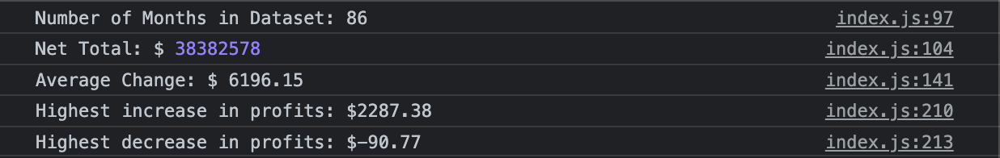

# Finance Task

## Abstract

This was an arithematic exercise in Javascript. Javascript can be used to sort through and organise data efficiently.

## Usage

To acces results, open deployed webpage, open Chrome Devtools, then Console. The results will be displayed. to see the convoluted way i arived at these reuslts, open the index.js file in my repo.

## Screenshot of console

## credits
 to math, you win
